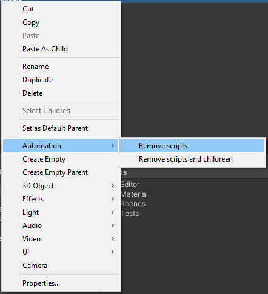
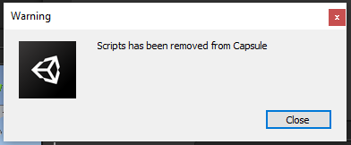
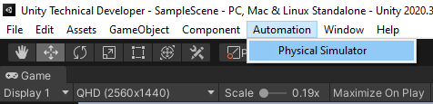
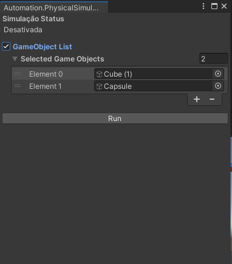
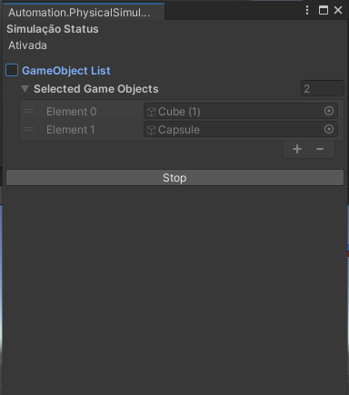

# Test-Unity-Tech-Dev-WildLife

This repository contains two automation scripts for your Unity project done for a freelance test.

# Script Cleaner
Script that removes all scrpits of a gameobject and its childreen

How to use it:

  - Right click on gameobject
  - Menu option "Automation" then "Remove scripts"

After the process, a confirmation message will be shown

-----------------------------------

# Physical Simulator ( 3D only )

Script that let you test physics simulation in your gameobject while in PlayMode

How to use it:

  - Open “Automation” > “Physical Simulator” on Unity menu
  - Simple drag and drop objects that you want to simulate physics and click in RUN

The Physical Simulator will add mesh collider and rigidbody on objects from the list and simmulate physics for you.
When you press the stop button, all physics components added previously will be removed and the simulation will be stopped.

